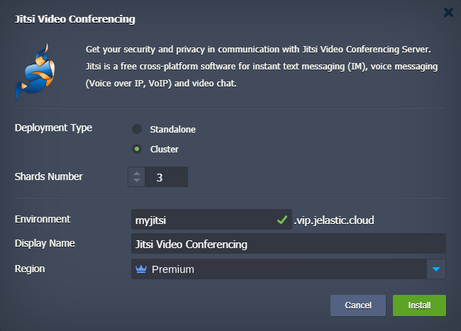
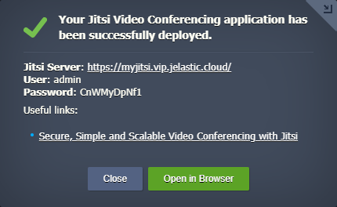

# Jitsi 

### Audio, video and text messaging in real-time without additional software and services

No time for the briefing. Different devices: Windows, Mac, iOS, Android, etc. Try a simple liaison tool Jitsi Meet. It is an online chat using open source technology called WebRTC. It allows you to transfer video, audio or text data between web browsers or dedicated clients.
 
## Jitsi Deployment to the Cloud

Get your Jelastic account at any of available [hosting provider](https://jelastic.cloud/).

Click the **DEPLOY TO JELASTIC** button, specify your email address within the widget and press **Install**.

> **Note:** If you are already registered at Jelastic, you can deploy this cluster by importing the  [package manifest raw link](https://raw.githubusercontent.com/jelastic-jps/jitsi/master/manifest.yaml) within the [dashboard](https://docs.jelastic.com/dashboard-guide).  
  
## Installation Process

In the opened confirmation window at Jelastic dashboard, if required change:  

* __Environment__ name  

* __Display Name__  

* destination __[Region](https://docs.jelastic.com/environment-regions)__ if several are available  

and click on __Install__.

 

Once the deployment is finished, you’ll see an appropriate success pop-up.

 

 The application is ready to use just press **Open in Browser** button and proceed to admin panel. Use provided credentials creating meetings.

For production mode, the installation will require a custom domain and traffic encryption with valid SSL certificate wich can be installed with [Let's Encrypt SSL Add-On](https://jelastic.com/blog/free-ssl-certificates-with-lets-encrypt/). Learn more how to [install Jitsi Meet in Jelastic](https://jelastic.com/blog/jitsi-video-conferencing/).
