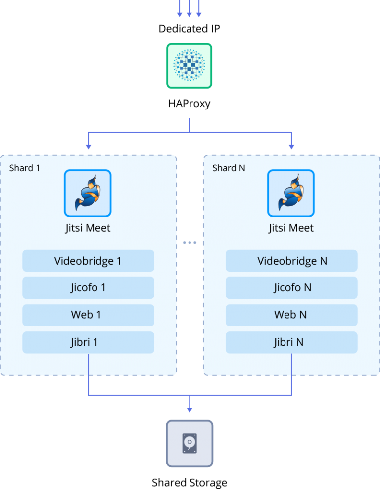

# Jitsi 

### Audio, video and text messaging in real-time without additional software and services

No time for the briefing. Different devices: Windows, Mac, iOS, Android, etc. Try a simple liaison tool Jitsi Meet. It is an online chat using open source technology called WebRTC. It allows you to transfer video, audio or text data between web browsers or dedicated clients.
 
## Jitsi Deployment to the Cloud

Get your Jelastic account at any of the available [hosting providers](https://jelastic.cloud/).

Click the **DEPLOY TO JELASTIC** button, specify your email address within the widget and press **Install**.

> **Note:** If you are already registered at Jelastic, you can deploy this cluster by importing the  [package manifest raw link](https://raw.githubusercontent.com/jelastic-jps/jitsi/master/manifest.yaml) within the [dashboard](https://docs.jelastic.com/dashboard-guide).  
  
## Installation Process

In the opened window at Jelastic dashboard, customize your installation:

* **Deployment Type**
  * _Standalone_ - all-in-one single node Jitsi installation
  * _Cluster_ - a reliable Jitsi cluster with multiple nodes (defined via additional **Shards Number** field), HAProxy load balancer, and a dedicated storage node to keep all the records in the same place

* __Environment__ name  
* __Display Name__  
* destination __[Region](https://docs.jelastic.com/environment-regions)__ if several are available  

Click **Install** to proceed.

Once the deployment is finished, you’ll see an appropriate success pop-up.

The application is ready! Just press the **Open in Browser** button to access the admin panel. Use provided credentials to create meetings.

Additional configurations like custom domain, SSL traffic encryption, some common Jitsi settings and upgrade procedure are described in detail in the dedicated **[Jitsi Video Conferencing](https://jelastic.com/blog/jitsi-video-conferencing/)** article.
